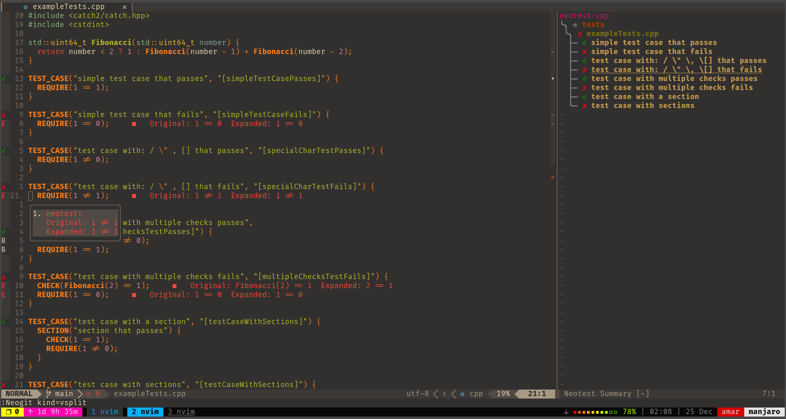

# neotest-catch2
This plugin provides a cpp(Catch2) adapter for the [Neotest](https://github.com/rcarriga/neotest) framework.


[](./demo.png)

## Status:

**Work in progress 🚧**.

## Seriously dont use it yet!

## Installation

Using packer:

```lua
use({
  'amar-laksh/neotest-catch2',
  requires = { "nvim-neotest/neotest" }
  })
```
## Configuration
Checkout out my config to understand how to set it up: [My config](https://github.com/amar-laksh/neovim-config/blob/main/lua/plugins/nvim-test.lua#L31)

## TODO

- [x] Test cases
- [x] Debugging test cases
- [ ]  Scenarios
- [ ]  Sections
- [ ]  Template test cases

